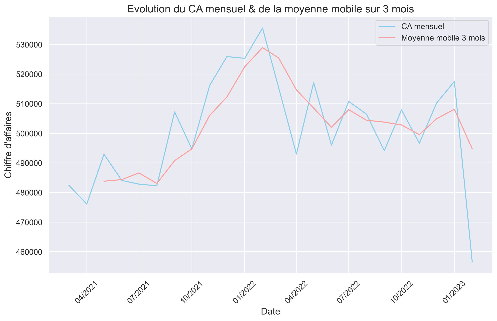
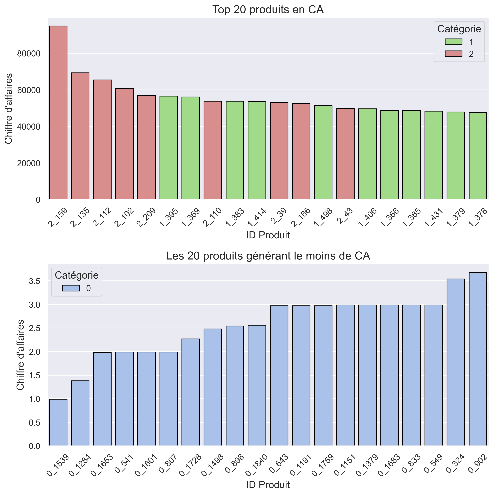
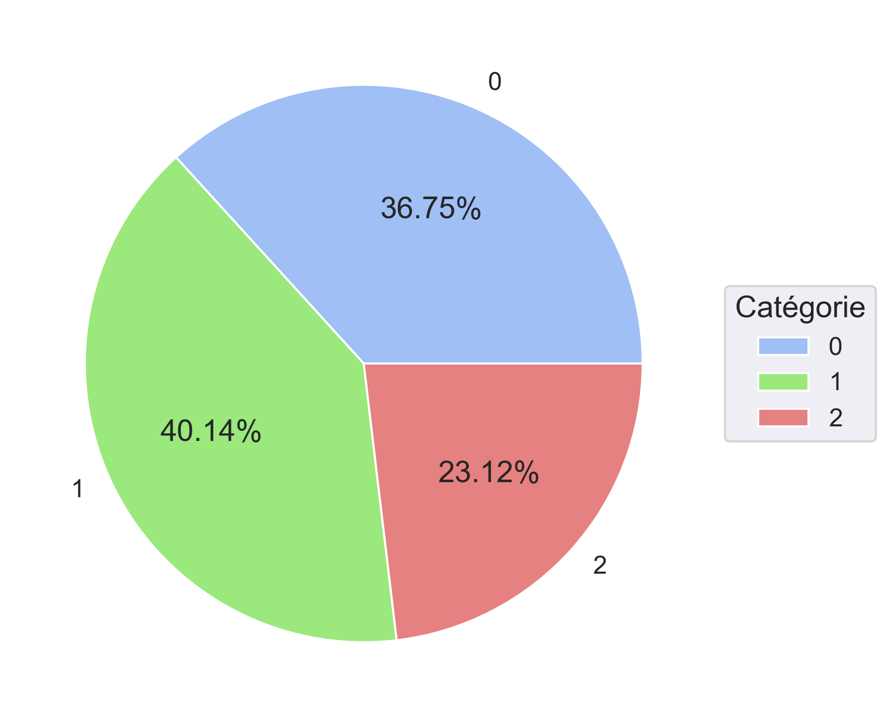
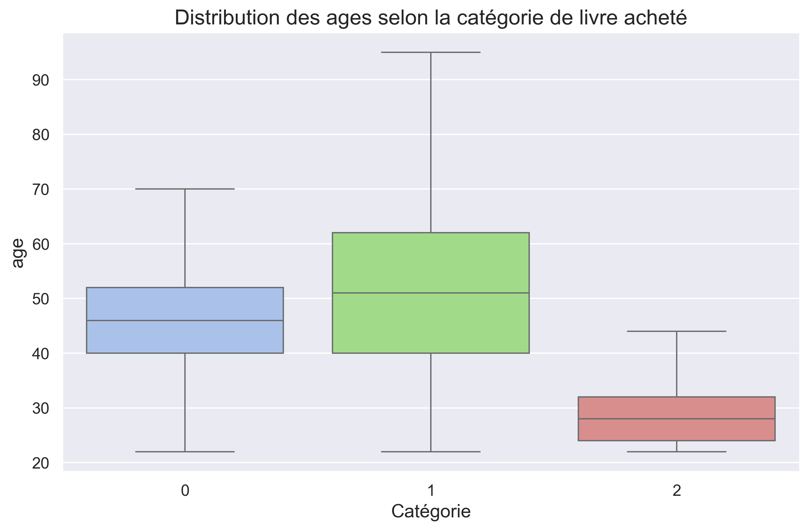

# 📊 Analyse des ventes - Boutique en ligne Lapage

## 🎯 Objectif
Analyser les ventes et le comportement des clients d’une librairie en ligne afin d’identifier des leviers de performance commerciale et des opportunités d’optimisation.

---

## 🧰 Outils
- Python (Pandas, NumPy)
- Visualisation : Matplotlib, Seaborn, Plotly
- Statistiques : SciPy, Statsmodels
- Jupyter Notebook

---

## 🗂️ Données utilisées
- Clients (âge, sexe)
- Produits (prix, catégories)
- Transactions (historique des ventes)

---

## 🧹 Préparation des données
- Vérification des formats et des clés
- Détection et traitement des valeurs manquantes
- Fusion des datasets
- Création de variables analytiques (âge, tranches d’âge)

---

## 📈 Analyses réalisées

### 💰 Performance des ventes
- Analyse du chiffre d’affaires global
- Évolution mensuelle et annuelle des ventes

- Tendances et saisonnalité

### 📦 Analyse produits
- Top / Flop produits (CA et volumes)

- Analyse par catégorie
- Contribution au chiffre d’affaires

### 👥 Analyse clients
- Segmentation par âge et sexe
- Identification des clients BtoB vs BtoC
- Analyse des comportements d’achat

### 🔎 Comportement d’achat
- Fréquence d’achat
- Nombre de produits achetés
- Panier moyen

---

## 📊 Analyses statistiques
- Test du Chi² (indépendance sexe / catégorie produit)
- ANOVA (différences entre groupes d’âge)
- Corrélation de Spearman
- Test de Kruskal-Wallis
- Courbe de Lorenz et coefficient de Gini

---

## 📌 Synthèse
- Analyse des tendances de ventes dans le temps
- Étude des comportements et segments clients
- Visualisation des liens entre variables (clients, produits, ventes)
- Mise en évidence de structures de consommation
- Évaluation de la répartition des ventes et contributions

---

## 👤 Auteur
Yoann De Cler
